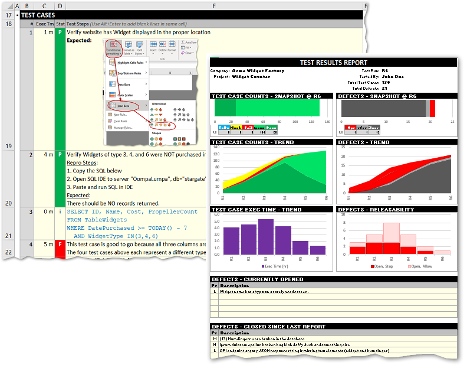
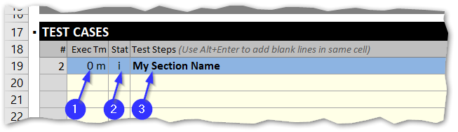
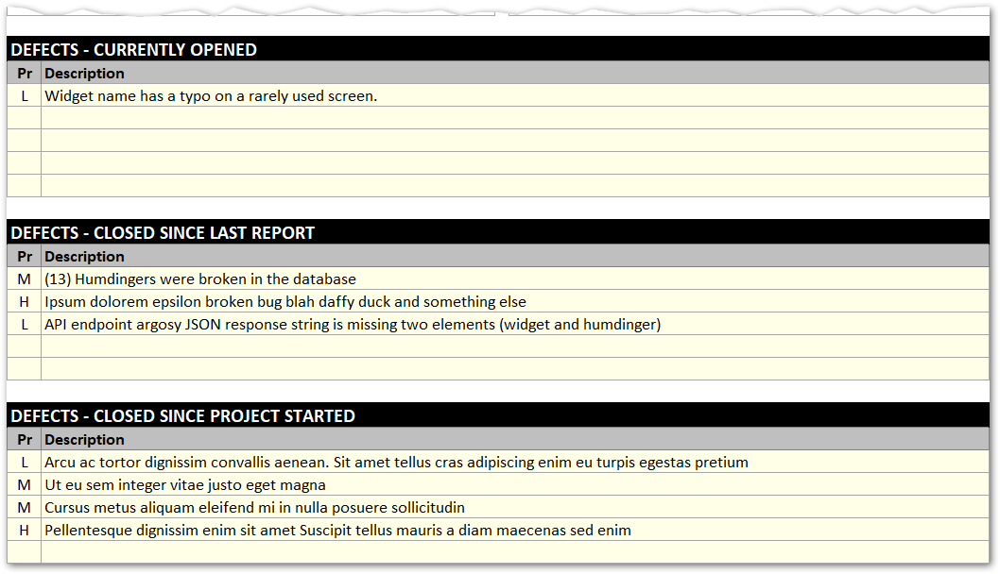
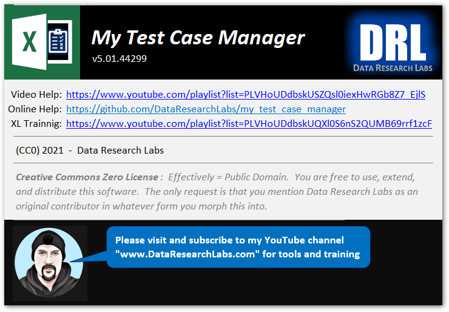

# My Test Case Manager (MTCM) 

* **What**: A lean, flexible XL test case manager for small to midsize projects 
* **When**: Good for traditional IT functional testing, UAT testing, or exploratory testing. 
* **Who**: Use it standalone as an individual contributor.  Use it as a team <a href="#multiUser">shared over a network.</a> 
* **Why**: Write test cases from a "flow state".  Better communicate and influence with insightful status visuals. 
* **How**: No code.  Minimal formulas.  Just simple, low-tech, organized worksheets.  Easy for you to adopt and evolve. 
* **License**: Creative Commons.  Free to use.  Free to copy.  Free to alter.  Free to distribute.  Am happy you find this tool useful. 

<kbd>
  
</kbd>
 
 
 

***If you like this tool, be sure to click the "Star" button above in GitHub.***

***Also, be sure to visit or subscribe to our YouTube channel*** www.DataResearchLabs.com! 

 

## Table of Contents
 - <a href="#introduction">1. Introduction</a>
 - <a href="#download">2. Download</a>
 - <a href="#gettingStarted">3. Getting Started</a>
 - <a href="#testCases">4. "Test Cases" Worksheet</a>
 - <a href="#testRunLog">5. "Test Run Log" Worksheet</a>
 - <a href="#report">6. "Report" Worksheet</a>
 - <a href="#about">7. "About" Worksheet</a>
 - <a href="#exploratoryTesting">8. Exploratory Testing</a>
 - <a href="#advancedTopics">9. Advanced Tips & Tricks</a>
 - <a href="#wrapup">10. Wrap Up</a>

### 1. Introduction 
**Do you need...** 
* to organize and track a small to medium size testing project?
* to communicate your testing status to the project team or a manager?
* a simple tool to better organize and track your exploratory test results?
* a lean tool to better organize and track your UAT test cases and results?
* a simple tool to manage up: providing metrics to make better decisions? 

**Can you answer...**
* with an estimate of how much test time another test cycle will take?
* how much time a full regression cycle will take?
* how much time remains in the current test cycle?
* what the pass/fail/block trend is over the past 5 test cycles?  
* how much time would be saved vs. risk increased doing Qualified Passes (skip testing because case passed in most recent 2 test cycles)?

If **yes** to any of the "Do you need"s or **no** to any of the "can you answer"s, then consider using "My Test Case Manager" (MTCM).  MTCM is a lean test tool designed to organize test cases and manage/communicate test results.  MTCM is a simple, minimalist design for software test engineers conducting functional or exploratory testing.  Business analysts can also use MTCM for conducting user acceptance testing (UAT).  You can write the test cases as you execute them, or plan and write them ahead of time.  Run results are tallied and graphed on subsequent worksheets.  You use the report and graphs to communicate status to your project team.  Show them how test cycles work, how test cases are built up over time, how regression testing works with each new build received, how risk is managed from build test to build test, etc.
 
 

### 2. Download
#### 2.1 Decision
Decide whether you want to start with the standard template or the large template:
|  Template File Name     |Test Case Count|Number Test Case Worksheets|Test Casess per Worksheet|
|:------------------------------|----:|---------:|--------:|
|my_test_case_manager.xlsx      |  300|         1|      300|
|my_test_case_manager_large.xlsx|5,000|         8|      625|

#### 2.2 Download
To download the "My Test Case Manager" tool (Excel spreadsheet) from this repository's /download folder,
1. [Right-click here with Open in New Tab](https://github.com/DataResearchLabs/my_test_case_manager/blob/main/download/my_test_case_manager.xlsx) 
2. Then click the download button
3. Then click the '...' button at browser Open File popup
4. Then click 'Show in Folder' from popup
5. Then copy the appropriate XLSX file: standard template "my_test_case_manager.xlsx" or large template "my_test_case_manager_large.xlsx" 

#### 2.3 Deploy
1. Identify or create a "parent" or "$" folder somewhere on your computer that is the parent to house all the test case data files
2. Create a "$\original_template" folder somewhere on your computer.  Paste the original copy (or both) that you downloaded there. Never alter these files.
3. Create a "$\projectX1" folder somewhere on your computer (or network if you are going to use it in shared mode as a team).
5. Paste a copy of the template into the new "$\projectX1" folder
6. Rename the template XLSX file accordingly (e.g.: "mtcm_projectX1.xlsx" or some equivalent).

#### 2.4 Sample MTCM XLSC Files
To download examples of the tool in use with sample data from this repository's /samples folder, [click here for samples](https://github.com/DataResearchLabs/my_test_case_manager/tree/main/samples), then click the sample file you want, and finally click the download button.

### 3. Getting Started
#### 3.1 General Data Entry Rules
* In general, you only ever edit the pale yellow text boxes, nowhere else!
* Avoid inserting or cutting rows and cells unless explicitly indicated to do so (i.e.: "Test Run Log" worksheet).
* The dark background cell areas are unused

#### 3.2 First Open / Security Notice
The first time you open a copy of the .xlsx file in a new folder, Microsoft Office security is going to render the file read-only to protect you.  The screenshot below shows the "Protected View" message (#1).  Go ahead and click the "Enable Editing" button (#2) to open up the file for your use.  Also note that there is *no* VBA code behind this spreadhseet / lightweight "application", so we do not need to worry about enabling macros or code.

 

#### 3.3 Setup "Project" Properties
Get started by opening the "my_test_case_manager.xlsm" file, then do the following actions where the numbers in the list below match to the numbered blue dots in the screenshot to the right. 

1. Click the Properties tab, if not already opened 
2. Then, type in your company name, for the report output 
3. Then, type in the project or team name 
4. Then, type in your name (or multiple analysts if appropriate) 
...and now your test project properties are setup. 
 
 

### 4. "Test Cases" Worksheet
#### 4.1 Opening "Test Cases" WorkSheet
To open the test case worksheet, click the tab titled "Test Cases". 
 
 

#### 4.2 Creating a Section Header
It is a good idea to organize your test cases under sections.  A simple way to make sections is to: 
1. Enter "0min" for the "Execution Time" column textbox 
2. Enter "i" for Information at the "Status" column dropdown 
3. Enter your desired Section Header title at the "Test Steps" column text box.  Also consider making the text bold to standout. 
Optionally, set the backcolor of all three cells in the row to your preferred section header color.  In the example screenshot below, light blue was used for the section header backcolor, but you can choose anything (suggest trying a darker back color with white font to make the heading really pop). 
 
 

#### 4.3 Writing Your First Test Case
**1. Test Steps:** First, write in your test steps (callout #1 in screenshot below).  Click the cell, type in your test case details, using Alt+Enter to force new blank lines and make the row taller.  In the screenshot  below, an example multi-line test case is written out (notice the formatting). 
**2. Status:** Next, callout #2 shows where to set the Status drop down.  Go ahead and set it to "T" for "ToDo" if you are not actually executing the test case right now.  If you are executing the test case as you write it, then pick "P" if it passes, "F" if it Fails, etc. 
**3. Execution Time:** Finally, callout #3 shows where to set the execution time to the number of minutes it took you to write and/or execute this test case depending on what you want to track.  For me, I tend to write and execute the test cases exploratory style for the first test cycle / test run so I combine both times.  Then during regression on subsequent re-runs of the test, I know this Exec Time column value will be substantially less, but at least I accurately captured the  initial write + execute time of test run #1 as well as the execution only time of test run #2.  Now that you know how to write one test case, you can write many. 
 
 

#### 4.4 Excel Formatting
1. **AutoSize**: Since the "Test Steps" cell is truly just a single cell (no merging) then the auto-size height works. 
2. **Formatting**: All standard XL formatting such as bolding and font color of individual words within the cell will work as expected. 
3. **Images**: You can even copy-paste a small image or screenshot as expected results into a cell. 
4. **Code Snippets**: Or paste in several lines of SQL to copy-paste-run as part of your testing. 
5. **Row Height Limit**:  Note that when using Alt+Enter to increase row height, Excel allows one row to expand up to 29 visible lines of text (I tested); more lines can be present in the row, they just won't be all visible and at some point the cell gets truncated 
6. **Tip 1**: Suggest splitting test details into multiple rows if needed. 
7. **Tip 2**: Note that any formatting you apply to the Status column will be overridden by the conditional formatting (unless you choose the value "i" which has none).
 

#### 4.5 Available Status Values
There are six possible status values available in the status dropdown show in the image on the left below.  Each status value has conditional formatting applied to set it to an appropriate color.  In the sample screenshot below, each value is displayed with a brief description of how to use each. 

 
 

#### 4.6 Validation Errors
In order for all the automated calculations, tables, charts, and reports to properly function, it is important that you fill in all three columns for each test case.  That means every row must have a value for ExecTm, Stat, and TestSteps columns -- no blanks.  If you do leave any columns blank (callout #1 below), the checksum counts will notice the mismatch and trigger  validation errors (callout #2) up at the top of the Test Cases worksheet as shown in the screenshot below. 
To correct the validation erros (make them disappear), simply fill in all the blank cells for any partially filled out test case row. 
 

#### 4.7 Current Test Results
The Test Cases worksheet is broken down into two sections: 
1. Rows 1-16 are for "Test Results" - a nice summary of counts and test time in a table with a graph. 
2. Rows 17-319 are for "Test Cases" - where all the details go.

These metrics automatically update as you write and execute test cases below.  They summarize all the results on this worksheet.  If you copy-paste the worksheet to make a second or third instance, then each will have their own self-contained Test Results section. 
I like to screenshot this section for status emails sometimes, to give a pretty summary of where the current Test Run / Test Cycle is at.  This is especially nice for when you are partially thru a test run and can show not only the actual time completed ("B"locked + "F"ailed + "Q"pass + "P"ass), but also the expected remaining time ("T"odo) because in theory you have the prior execution times still in place from your last run...or you've entered the expected time to execute in. 

#### 4.8 Deleting Test Cases
1. **Better Way**: The simplest way to delete a test case is actually to just highlight the three yellow cells (ExecTm, Stat, and TestSteps columns) for a test case and press the delete key.  In the screenshot below, three test cases are highlighted and will be deleted as soon as either the Delete key or Backspace key is pressed on the keyboard. 
2. **More Complex Way**: Note that it is a bit more complicated to highlight and delete entire rows.  Although it works without impacting automated calculations and graph results, you would lose overall test cases (dropping from 300 to 300 minus the one ore more rows you deleted).  You could always copy an empty row and paste insert it back in to recover, but that process is more complex than simply highlighting and deleting cells in the there columns we edit. 
3. **Test Case Number Column**: Do not change or delete the formula that calculates the Test Case # in column B. 
 

#### 4.9 Resetting Test Case Status in Bulk

The design of My Test Case Manager is lean and simple.  As such, only one test case run result state is maintained in the "Test Cases" worksheet(s) -- the current state.  (Note: You could copy "Test Cases" worksheets and name the tabs as versions to track state yourself if you so desired.)  
This then raises the question, "How do I reset the test case status from Pass or Fail or Block or QPass back to Todo at the start of each new test cycle?"<br 
The answer is to use Excel's "Find and Replace" feature (Ctrl+H) to replace cells having an exact match on case and the entire contents.  In the screenshot to the right, item #1 is the find what set to "P" with item 2 replace with set to a "T".  Note that you have to click the Options button (item 3) so that you can see and check item #4 Match case and item #5 Match entire cell contents.  Then click Replace All to rest the passes to todo's.  Repeat for "F" to "T", "B" to "T", and "Q" to "T".  Leave the i's alone as they are just informational.  I optionally change all the "P"asses to "Q"ualifiedPasses and leave the "F"ails and "B"locks as a reminder of prior cycle high priority cases.  Then I can pick and choose which "Q"pass cases to regress (flipping to "P"ass typically); and then focussing remaining limited time on the "F"s and "B"s. 
 
 

### 5. "Test Run Log" Worksheet
#### 5.1 "Test Run Log" Levelset
To open the test run log worksheet, click the tab titled "Test Run Log" (callout #1 below). 
This form is used at the end of every Test Run (Test Cycle) after you're done executing all the test cases from the prior worksheet.  You simply transcribe the automatically calculated totals from the Test Results table (in cells J5 thru J9 from the upper right section of the Test Cases worksheet) into the appropriate cells on this worksheet.  Likewise, you transcribe the defect counts from your defect system (typically a website like Jiri or any other bug tracking tool). 

There are a few key points here that need to be emphasized:

1. You are manually entering these values when a test run / test cycle is completed. 
2. These values drive the Report worksheet to the right. 
3. You enter test case status counts taken from the "Test Cases" worksheet
4. You enter defect counts taken from your Defect system (some other web application most likely) 
   However, you could track failed test cases as defects manually in the sections below if necessary. 

#### 5.2 Inserting Test Run Rows
The general process for entering Test Run (test cycle) row data is as follows: 
1. First, enter **Test Run #1** results in row R1 that comes default (callout #2).  At this point, the report will **not** have a trend. 
2. Next, enter **Test Run #2** results in row R2 that comes default (callout #2).  At this point, the report **will** have a trend. 
3. For **Test Run #3** and beyond (regression), follow the instructions in blue text (callout #3) to insert a new test run.  It is important to copy and then insert paste the last line on top of itself, pushing itself down a row.  This maintains all the automated reports and charts, so the series automatically resize and you only have to change the values in the lowest row that was pushed down.  I will demo this in the YouTube training videos (showing is easier than describing).
 

The steps above apply to the single "Test Case" worksheet standard template "my_test_case_manager.xlsx".  **If** you are using the larger template "my_test_case_manager_large.xlsx", then there is an additional section added in to the "Test Run Log" worksheet that will save you time.  In the screenshot below, calluot #1 shows where the new auto calculated values are located.  These calculated values include today's date plus rollup totals for the execution time and test case counts per status across all eight TC1-TC8 worksheets.  You simply copy the values in blue box at callout #1, then paste AS VALUES ONLY into the last row of orange cells in the lower table **after** creating a new row to paste into following the standard blue box instructions.  Sure, we could have used VBA programming via a button to just do this automatically, BUT that would then have added extra security considerations and steps for everybody (maybe in the future we will have a template with code behind a button, but not for now).
 

#### 5.3 Entering Test Run Values
It is important that you properly fill out all of the columns for each Test Run / Test Cycle row.  Only enter values into the pale yellow cells (leave the calculated silver cells alone). 
Here are the column definitions and suggestions about how you should use them: 
1. **Run #:** This is the Test Run or Test Cycle Number.  Use "R1", "R2" style formatting.  A Test Run or Test Cycle is as complete a pass thru executing the test cases as you can possibly do for a given build or release or at a given point in time.  Use sound judgment in determining when to start and stop a Test Run or Test Cycle. 
2. **Test Run Description:** The name you give a Test Run (or Test Cycle) is important.  It helps tell the story of how and what you tested and what issues you ran into.   Management and others on the development team often believe testing is simple and linear. *"There's 60 test cases, they _should_ take 1 minute a piece, so why aren't you done in 60 minutes?"*  
By properly naming and organizing your test cycles, you can help educate your team on how there are multiple test runs, the scope grows as does your understanding and available tests to run.  Example names might be "Sprint 05", or "Release 2.3", or "Week 14", or "UAT for Project X", etc. 
3. **Date:** Use the date the test run was completed. 
4. **Execution Time (hr):** Enter the total execution time as automatically tallied back in the Test Cases worksheet.  If you copy-pasted multiple Test Case worksheets, then use a formula here to sum those values together. 
5. **Test Cases:** Enter the ToDo, Block, Fail, Qpass, and Pass counts as automatically tallied back in the Test Cases worksheet.  If you copy-pasted multiple Test Case worksheets, then use a formulate here to sum those values together. 
6. **Defects:** It is up to you to either track here or fetch from your defect system the following counts:
   * **Open, ShowStoppers:**  This is the count of high priority/severity issues that will block release
   * **Open, Allow:** This is the count of low-medium priority/severity issues that can ship/deploy
   * **Defer:** This is the count of deferred defects where a decision was made to ignore for now
   * **Closed:** This is the count of fixed/retested/closed defects
 

### 6. "Report" Worksheet
#### 6.1 Introduction
The "Report" tab is very important.  You should use screenshots of these graphs to communicate yuor testing status, or story, to the project team and to management. 
* It is nice to be able to depict that testing is not a single pass, single dimensional event; but that there are multiple releases that need to be tested. 
* It is nice to depict the impact to schedule that blocked test cases have had when they are finally tested and yield high defect rates. 
* It is nice to show the risk that qualified passes on regression tests to meet a deadline have to the final release. 
* It is nice to show the actual execution time in hours it takes to test each test cycle (release, sprint, group of builds, etc.). 
* It is nice to show how the actual execution time tapers off once test creation is done and you are simply regression testing (execution) only. 
* It is nice to plan the final release around stability, where there have been NO show stopper defects in the last two releases, and mininmal (or no) "allowed" (low priorit) defects. 
* It is nice to to keep a list of defects organized in three buckets (Currently Open, Closed-Since Last Report, Closed-Older) so that you can copy-paste them into a weekly status report email. 

#### 6.2 Report Header
The report header shows the company  and project names at the upper left section of the report.  These are the same values entered in the Properties tab.  The right section of the report headers indicates which Test Run / Test Cycle (e.g.: "R6") that is currently being displayed.  The tester's name (also from the Properties tab) is also displayed in this section.  The total test case count and total defect count is also tallied and displayed in the right side of the report header.
 

#### 6.3 Test Case Count Graphs

The test case count graphs are located on the left half of the page, directly below the report header. 
1. There is a snapshot graph on top depicting the test case counts for the latest release (R6 in our example below). 
2. Below that is a trend graph showing test case results over time. 
 
In the snapshot graph to the right, the dark green bar tells me that 26 test cases were executed and passed on this final R6 Test Cycle.  It also tells me that 104 test cases were Qualified Passes, which typically means they passed on a prior Test Cycle, but due to time constraints we did not regression test them again on the latest test cycle.  At a glance, I can see our risk exposure in R6 is one test case executed per 4 we skipped based on a prior test cycle pass. 
 
If the project team and management believe quality is important, then we can ask to do a full regression test by executing the 104 QPasses.  Furthermore, we can tell them exactly how long it will take by pulling the ExecTm value off of the most recent "Test Results" graph back on the "Test Cases" worksheet.  Makes for better decision making all around. 
 
I can also see in the trend graph that the number of blocked and failed test cases started off high, then tapered off as the project stabilized.  I can also see that from R4 thru R6, we increasingly relied upon qualified passes to meet deadlines (rather than executing full regression coverage). 

#### 6.4 Defect Count Graphs

The defects graphs are located on the right half of the page, directly below the reoprt header. 
1. There is a snapshot graph on top depicting the defect counts for the latest release (R6 in our example below). 
2. Below that is a trend graph showing defect results over time. 
 
In the snapshot graph to the right, I can see that all but one defect has been either closed (fixed) or deferred.  The one that remains open should be futher analyzed (if this R6 build is the final before released) to determine whether it should be reset to "Defer" or if it is actually a lower priority "Open, Allow" defect (which it is).  The trend graph tells me that defects started off relatively high in R1, then tapered off as the project stabilized. 
 
 
 
 
 

#### 6.5 Test Case Execution Time Graph

The execution time trend graph is located on the left, below the test case count graphs.  This handy graph tells me that the time it took to execute test cases for the given Test Run (or Test Cycle) increased steadily from R1 (Run 1) to R2 to R3 as I built more and more test cases while concurrently regression testing the entire suite (no Qpasses).  However, notice the time savings starting in R4 where the actual test case writing tapered off and the qualified passes (skipped executing of test cases) started occurring.  By R6, most of the prior test runs' test cases were _NOT_ being regression tested, we simply executed a the few new test cases plus a handful of important existing cases to save time.  That increases risk (because those skipped / Qpassed tests might now be broken), but decreased time.  We can readily estimate how much time it would take for a full regression cycle at R6 by referencing the total time in R3 (full regression plus some extra test case creation time) and R4.  Or for a more precise estimate, we could pull the Qpass Execution Time value from the "Test Cases" worksheet (top right chart).

#### 6.6 Releasability Graph

The defects - releasability graph is located on the right, below the defect count graphs.  This graph is very useful in situations where you are pressured to release but are not yet quite ready.  You can show by test run (test cycle) number how the Open Showstoppers were present earlier but then tapered off (good) and how all that remains is lower priority defects that should either be deferred, or accepted as Open, Allowable.  The graph could also be used to show a negative trend, if for example the bright red open showstoppers were trending up towards the most recent release, that would indicate a project that is destabilizing and you might want to put in another full regression test run / test cycle requiring 0 defects and 0 test case fails. 
_Suggestion:_ At the beginning of a project, establish agreement that for a release to occur, all test cases must = "Pass" (and optionally allow "Qpass" where the risk is accpetable); and 0 show stopper defects can be found in the final TWO test cycles (this will ensure you get adequate test time because if a new show stopper is found, you just got another test cycle as a buffer or hedge).

#### 6.7 Defect List
The defect lists at the bottom half of the report are optional.  These lists can be a useful way to track defects on smaller projects so that you can report "summary" level defects in say a weekly status email.  You could list the currently open defect names plus priority.  Below that you could copy-paste the section of defects closed since last week to show progress.  Not sure it is worth the effort to track the closed defects since project start, but you could do that too.  The basic flow is to copy-paste defects into the top section (currently open), then migrate them down to closed since last report, then finally move them down to the bottom section.
 

### 7. "About" Worksheet

The "About" worksheet accomplishes a few goals; it informs the user... 
1. Of the "application" name and version. 
2. Where to watch training videos about the tool. 
3. Where to find the tool on GitHub. 
4. That the tool and all documentation are Creative Commons Zero license...effectively Public Domain which means I grant you full and free usage.  
I hope it helps you in your company and makes you more productive.  I am happy for you if you extend and modify or alter the tool.  Do what you need to do...that's what the About worksheet indicates.  One caveat, please do click the GitHub star button for this project, and visit my YouTube site and subscribe at www.dataresearchlabs.com.  

### 8. Exploratory Testing
#### 8.1 Introduction
James Whitacre of Google and Microsoft fame wrote the outstanding book ["Exploratory Software Testing"](https://www.amazon.com/Exploratory-Software-Testing-Tricks-Techniques/dp/0321636414) back in 2009.  I purchased it, read it, and implemented many ideas from it over the years.  I highly recommend that you purchase and read the book too (and no, I receive no benefit from this endorsement, it just is a really great book filled with great ideas0.

In the spirit of Whitacre's exploratory testing, I enjoy applying his tours through this Excel template with its freedom to wander through an application.  I've summarized some of my favorite tours from his book and added in a few of my own.  Exploratory testing tours really helps you to find bugs.  Getting into character by putting on various "tour hats" really gets you into a creative, bug finding mindset.

#### 8.2 Test Tour List
The list below includes the "Tour Name" in bold followed by a dash and then a brief description of the tour.  You basically pick a tour, then jump in and start walking through the application under test, exercising from the perspective of the given tourist.  It really is surprising how many test case ideas it generates, and how many defects the approach can uncover when you think beyond the basic acceptance criteria and functional requirements given to you in your user stories.

* **The "Acceptance Test" Tour** - Tests driven by user story acceptance criteria.  Everybody should always naturally do this, even without a specific tour plan.
* **The "Happy Path" Tour** - Tests driven by walking through the application exactly as it is intended to be used, or how you would expect it to be used absent adequate documentation.
* **The "Wandering Happy Path" Tour** - Tests driven by walking through the standard use cases, but also wandering a bit to connect them up.
* **The 'Garbage Collector's" Tour** - Test driven by picking up all the trash; go back and test all the low priority skipped edge cases, the archived emails with miscellaneous notes, etc.  Final pass before sign-off.
* **The "Money" Tour** - Tests driven from a Sales point-of-view (example - follow the steps for a sales demo of your application).
* **The "Landmark" Tour** - Tests driven from a Landmark hopping (feature to feature) point-of-view.
* **The "Intellectual" Tour** - Tests driven from asking difficult or complex questions of the software.
* **The "FedEx" Tour** - Tests driven by following data through the system (end-to-end), just like a package thru FedEx tracking.
* **The "After Hours" Tour** - Tests driven by "after hours" features like archiving data, backing up files, running maintenance jobs, etc.
* **The "Bad Neighborhood" Tour** - Tests driven by focusing on areas where bugs exist (because bugs tend to cluster, so find the cluster and dig in).
* **The "Museum" Tour** - Tests driven by focusing on legacy code.
* **The "Regression" Tour** - Tests driven by regression (execute all the test cases to check if any existing feature got broken anew).
* **The "Supporting Actor" Tour** - Tests that focus on the secondary features that are proximate to a primary feature
* **The "Back Alley" Tour** - Tests focussed on the least used features, or code not yet covered (if you have code coverage tracking tools)
* **The "All Nighter’s" Tour** - Tests focussed on running the app for as long as it can go (like going to just one more club for one more drink; how long can the app go before collapsing?)
* **The "Collector’s" Tour** - Tests that focus on checking every box (like visiting every state, or hitting every pub); getting one of every output until you’ve covered the collection sought
* **The "Supermodel" Tour** - Tests that focus strictly on the superficial (only skin deep) – interface only, not functionality nor interaction (does it look good, render properly, refresh fast enough, etc.)
* **The "Cancelled Show" Tour** - Tests that start then stop because “rained out” (e.g.: hit every cancel button combination, Shift+F4 or X to close an app, start, then stop, then re-start)
* **The "Couch Potato" Tour** - Tests that do as little as possible, accepting all default values through the app (especially blanks and minimal input where possible)
* **The "Saboteur" Tour** - Tests that try to undermine the app everywhere and in everyway possible (e.g.: ask app to read a file that you then corrupt, or read a file on the network but pull the ethernet plug, alter file permissions to deny access, overfill a disk, etc.)
* **The "Opposites" Tour** - Tests where enter the least likely input every chance you get (e.g.: print -12 pages, 9048 items in shopping cart, etc.)
* **The "Crime Spree" Tour** - Tests where enter known illegal values, try to trigger errors and do actions that break the software
* **The "Wrong Turn"Tour** -Tests where do legal actions in the wrong order to try and trigger a bug
* **The "Obsessive-Compulsive" Tour** - Tests that repeat the same thing over and over (like copy-paste, copy-paste, over and over; or enter data on screen, then return and enter again)or repeat every step of another tour twice, or three times
* **The "Tour-Crasher" Tour** - Link test scenarios together, hopping from one to the next to try and trigger odd integration issues
 

### 9. Advanced Tips & Tricks
#### 9.1 Using "Jump Stops" 

"Jump Stops" are just a name given for a usage trick.  In Excel, you can use the Ctrl+Up and Ctrl+Down keys to jump to the next cell up or down that has data.  Columns "A"and "F" are thin, always empty border spaces.  If you place single characters (like an "x") into important roww along either column, then you could use Ctrl+Up and Ctrl+Down to quickly jumpt thru your 300-ish test cases.  I like to use the "▪" character to mark my jump points, but "x" or similar is fine too.  Tip: You can really have fun and use the Wingdings or Webdings fonts to come up with clever jump stops like a bomb icon for defects, or a skull and cross bones icon, etc.  I also like to put a mark at the first row (17) and the last row (319) so that I don't jump past them.   Then I use Column "A" for tagging section headers, so I can quickly jump to each section or block of test cases.  I use Column "F" for marking test cases that are either failing or blocked so I can quickly jump to the troublespots. 

#### 9.2 Sample SQL Test Case

If you have a test case that involves running a SQL command, then it is a good idea to embed the SQL statement right into the spreadsheet.  The example to the right depicts best practice where the test case details are on the upper row, and the SQL in a separate row below that.  Keeping the SQL separate and in its own row makes it really easy to click the cell, press Ctrl+C to copy the SQL command and then paste and run in your database management IDE.  If you were to place the SQL in the same test case cell as the desription and repro text, then you'd have the disadvantage of having to click carefully into the cell and highlight just the SQL each time.  Also note that we don't want to double count the execution time so we set the lower SQL case to 0 minutes, and we don't want to double count the pass or fail so the SQL row is set to status = "i" for informational.  Optionally, the SQL text font color was set to blue (or whatever color you prefer to standout when working thru test cases). 

#### 9.3 Sample Embedded Image Test Case

If you have a test case that could benefit from showing an image or clip from a screenshot as an expected ersult, then it is a good idea to embed the image right into the test case.  An example is shown to the right.  Just enter a test case as you normally would, BUT press Alt+Enter several times to make the test case row a taller, giving ample space to paste-in the image you have copied into the clipboard. 

#### 9.4 Adding More Than 300 Test Cases 
The standard template "my_test_case_manager.xlsx" comes default with a single "Test Cases" worksheet comes with 300 test case rows.  This is fine for small projects, but what if you have larger projects and need more than 300 test cases.  The simplest answer is to download the "my_test_case_manager_large.xlsx" which comes default with eight test case worksheets each having 625 test cases for a total of 5,000 test cases.  You really shouldn't go past that, it becomes too cumbersome.  It would probably be a better idea to break your tests down into separate test case files with one to two thousand test cases in each.  But hey, if you really want 50,000 test cases in spreadsheets, then go for it...just put 10 different copies of the large template in use. 

 
 

If you still want to start with the standard 300 template and expand from there, then there are two approaches to add new test cases.
1. **Copy-Paste More Rows:**  The first option would be to simply copy one empty test case row (between 19 and 318), then highlight row 318 and drag down 100-, 300- or 500- rows, then right-click and select "Insert Copied Cells".  
2. **Use Multiple Worksheets:** The second option is to Copy the "Test Cases" worksheet, making a second set of 300 test cases.  To do that, double-click the "Test Cases" tab and rename it to something cleaner (like "TC1" or whatever).  Next, right-click the "TC1" tab, click "Move or Copy" from the popup menu, check "Create a copy", and select the worksheet before which you want the copy placed, and click Ok.  Finally, double-click the "TC1 (2)" new worksheet and rename it (probably to "TC2". 
Note that if you add one or more worksheets (nice and clean approach), you will have to be careful when tallying Test Run results on the "Test Run Log" worksheet to include ALL counts across ALL test case worksheets.  Just use a formula like this "=23+34+12" if you for example had 23 passes on TC1, 34 Passes on TC2 and 12 Passes on TC3.
Download example "mtcm_sample_2.xlsx" from https://github.com/DataResearchLabs/my_test_case_manager/blob/main/samples/ to see how multiple test case worksheets (tabs) can be implemented. 

#### 9.5 Using With Multiple Users 
The spreadsheet tool (MTCM) is best used by individual contributors as a local standalone Excel file.  The "My" in "My Test Case Manager" is meant to emphasize this tool's use as a force-multiplier for individaul contributors.  It is meant to make you more efficient without having to put in a purchase order request or run through all the red tape with IT to install an application (this is just a code-less spreadsheet).

However, this simple spreadsheet tool can be effectively shared by multipled team members at the same time.  Proof: I used a similar spreadsheet 12 years ago at a large aerospace company in which a team of 4 shared and concurrently used it all day long.  Also at a more recent job, folks saved out several Excel files to SharePoint and we all concurrently worked the files just fine.  

Some shared use suggestions are as follows:
1. **Use Multiple Worksheets:** one per tester.  This virtualy eliminates the risk conflicts (changing same cells at sametime).
2. **Use Large Template:** Use the "my_test_case_manager_large.xlsx" file.  It starts off configured with 5,000 test cases and eight separate test case worksheets.
3. **Use "Share" Button**:  Office 365 has a "Share" button in the upper right corner that will walk you through the process of sharing the Excel template up on your company's OneDrive. 
Disclaimer: I have not done this myself yet, but have seen and used nwer Office 365 XL files shared by others. 
Disclaimer: Back in 2009 at a large aerospace company, we had a team of four sharing a test case spreadsheet by simply copying the XL file out to a network share and turning on the share mode -- not sure Office 365 allows this any more, but that was an easy option back in the day.

#### 9.6 Fix Conditional Formatting Mess
Microsoft Excel "Conditional Formatting" is very useful.  It is what allows the pretty Dark Green background for a Status = "P" (for Pass), or Bright Red background for Status = "F" (for Fail).

Unfortunately, there is a donwside to the conditional formatting.  When you start out with a clean XL "My Test Case Manager" template, there are only 5 Rules in the worksheet if you click "Conditional Formatting" > "Manage Rules" and scroll the list.  However, if you routinely copy-paste any cells within Column "D" (Status), then XL starts duplicating the rules over and over.  What started out as a simple single rule per status across the entire range $D19:$318, gets broken up into more and more, smaller and smaller ranges.  You can eventually end up with hundreds of rules.  Now chances are you won't notice any problems, everything will display and calculate fine...just slower.  

**To prevent** this from occuring, simply do not copy-paste from Column "D" status.  Highlighting and deleting the values is fine.  Using Search and Replace is fine.  Just don't copy-paste.

**To fix** the problem, simply highlight all cells in Column "D" except one (important to keep one!).  Then select "Conditional Formatting" > "Clear Rules" > "Clear Rules from Selected Cells".   If you check the rules now, there will only be the base set of 5 (one for each status type), but limited to the single cell we left with formatting (undeleted).  So the final step is to restore the conditional formatting back across the entire range.  You can either manually reset the applies to back to the full range "$D$19:$D$318" across each of the five rules in conditional formatting rules manager; or, you can use the format painter to copy-paste the formatting to all 300 cells.  Your choice, same result either way.

#### 9.7 Detail Sheets
There are times when you have (a) large SQL statements, (b) large screenshots of expected results, (c) large precondition test data sets, etc. which just will not fit in the test case worksheet.  In those instances, just go ahead and insert a new worksheet off to the right and label it something like "Dtl_1" for detail sheet #1.  Then insert the SQL or image or test data into this worksheet.  Sometimes I hide the gridlines and put multiple blocks of SQL code in here, separating with title rows as shown in the screenshot below.  Other times I put large SQL statements in separate detail sheets.  Sometimes I put large test data sets int their own detail sheets and then use formulas to make insert into scripts.  Sometimes I use a detail sheet to track performance of SQL test runs.  You can put whatever supporting materials into detail sheets that you need to. 

To add a link that jumps a user to the Detail Page, follow these steps:
1. Right-click the cell
2. Click "Link"  >  "Insert Link"
3. At the popup, click Link To = "Place in This Document" 
4. Either type in a cell reference, or select the Worksheet from the ilst of Cell References
5. Click Ok.
 
 
 

### 10. Wrap Up
#### 10.1 Thank You
Thank you very much for reading all the way down to the end of the documentation.  Time is valuable and ever more scarce in today's busy world.  Few people make it this far.  If you did, I hope that means you found value in this tool / spreadsheet / "software".  I hope it makes you and/or your team more productive.  I am happy if you adopt the spreadsheet then change and evolve it to meet your needs.  I am happy if you fork this repository and build your own.  I am happy and would roll-in to the master branch any chanes you might make from which other may benefit. Thank you for your use and support. 

#### 10.2 YouTube Training & Resources
If you like this tool, please visit and subscribe to my YouTube site at http://www.dataresearchlabs.com and check out video training for this "product" as well as other related tools and training. 

#### 10.3 MTCM History
"My Test Case Manager" has been a work in progress, arriving at version 5.x over the last two plus decades. 

* **Ver 1.x** - At some point in 1998 I built my first Test Case Manager, version 1.x in Access 97.  I've last track of it now 23 years later. 
* **Ver 2.x** - In late 1999, I started my first freeware hobby site "pb-sys.com" for Pierce Business Systems (retired in 2003).  Test Case Manager 2.11 was last deployed in October 3, 2000.  This version was pretty extensive.  It had many screens, many reports, user definable fields, and even supported multiple languages complete with a language translation file builder.  You can [check it out here on the wayback machine](https://web.archive.org/web/20000611181859/http://www.pb-sys.com/).  The bottom line though was that like most test case management systems, the overhead was too heavy and you could never achieve "flow state" when writing or especially executing test cases exploratory style.  It was Microsoft Access which has many knocks against it (file not server based, client-server not web-server, etc.). 
* **Ver 3.x** - In 2009, I worked at a large aerospace company with two functional analysts who were experts in the field and came from telecommunications.  They were using a spreadsheet to track test cases.  I used and liked their approach.  A couple years later, I started my second freeware hobbysite "wintestgear.com" (retired in 2013).  I took the good parts of TCM version 1.x and 2.x and combined them with the spreadsheet idea from the two functional analysts plus a [real estate investment spreadsheet tool](https://web.archive.org/web/20100205084132/http://www.wintestgear.com/products/retired/PPREIA.html) I'd built.  "TCMLite" was born and published starting in 2010.  You can [check it out here on the wayback machine](https://web.archive.org/web/20100203224308/http://www.wintestgear.com/products/TCMLite/TCMLite.html). 
* **Ver 4.x** - Over the next 10 years, I occasionally modified and used various incarnations of TCMLite for my day job.  In 2013, I used it fairly heavily for about a year at an insurance company to test software.  In 2019, I used it heavily for about two months to test on a project having lots of churn.  These version 4's were never pubilcly released anywhere.  I just chipped away at simplifying the implementation, keeping only the important high-use parts and discarding the rest. 
* **Ver 5.x** - In early 2021, I started my third hobby site; this time not freeware focus but YouTube training focussed.  DataResearchLabs.com is slowly growing and I'd like to run an experiment to test a hypothesis.  I believe I can generate more viewers by freshening up this old tool and re-releasing it to seed new viewers.  I've been using one version or another of it for 20+ years and it works pretty good.  Expanding and improving the documentation (above and within a week or two out on YouTube) will help.  Another reason driving Version 5 is that I've recently switched jobs and can really benefit from using this template for UAT work.  Happy when hobby and work overlap. 
 

